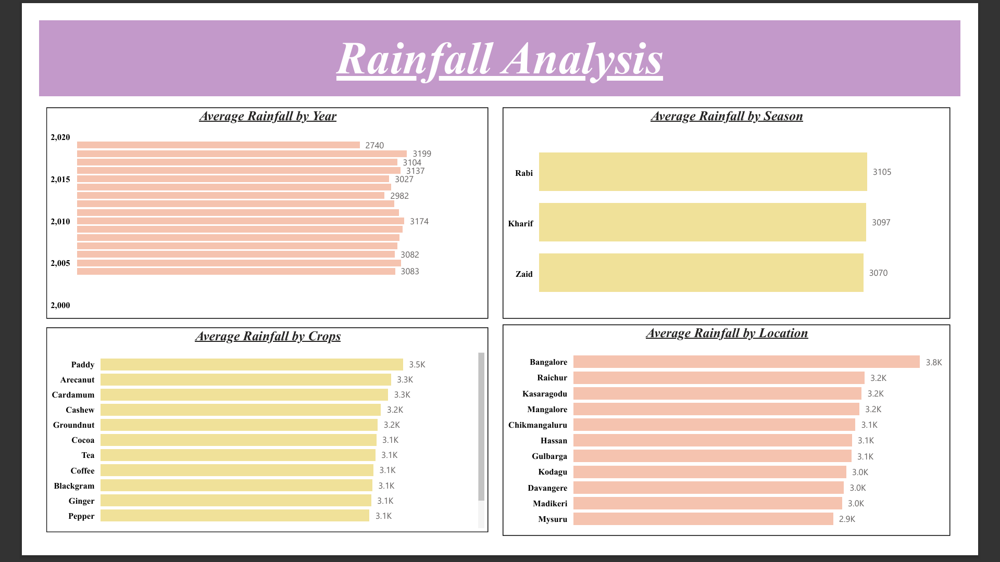
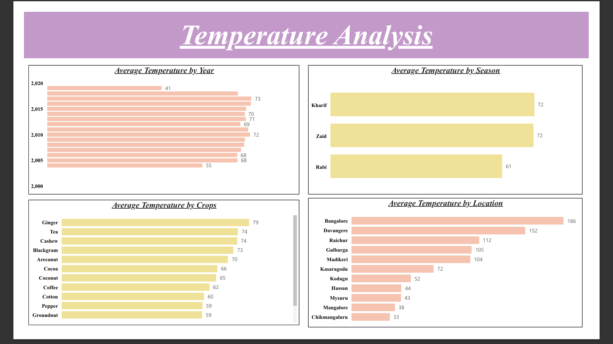
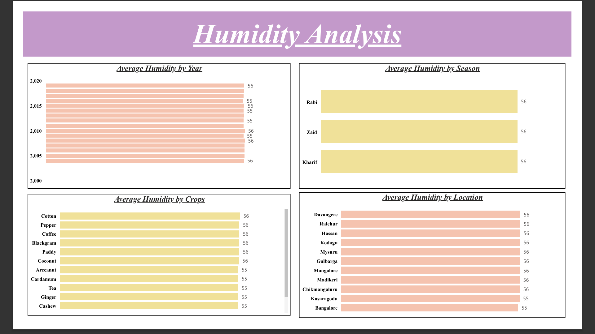
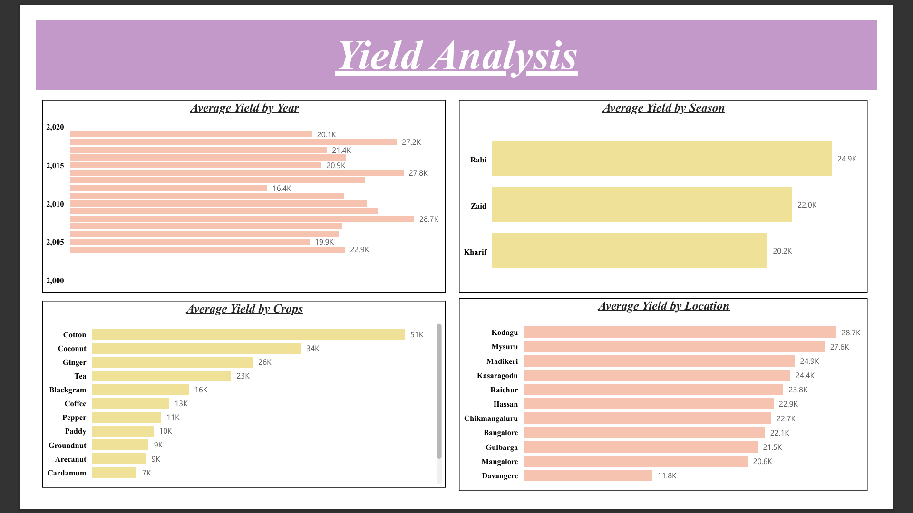

# AWS + Snowflake + Power BI Data Pipeline

## 📌 Project Overview

End-to-end data pipeline built using AWS S3, Snowflake, and Power BI to analyze agriculture data.
The project demonstrates data ingestion, transformation, and visualization.

---

## ⚙️ Tech Stack

* AWS S3 (Data Storage)
* Snowflake (Data Warehouse)
* SQL (Data Transformation)
* Power BI (Dashboard & Visualization)

---

## 🔄 Data Pipeline Flow

1. Upload CSV data to AWS S3
2. Connect Snowflake using storage integration
3. Create external stage and load data into Snowflake
4. Perform SQL transformations (cleaning, grouping, feature engineering)
5. Connect Snowflake to Power BI
6. Build interactive dashboards

---

## 📊 Dashboards

### Rainfall Analysis



### Temperature Analysis



### Humidity Analysis



### Yield Analysis



---

## 📁 Project Structure

```
aws-snowflake-powerbi-data-pipeline/
│
├── sql/
│   ├── 01_s3_snowflake_pipeline.sql
│   └── 02_data_transformation.sql
│
├── data/
│   └── agriculture_dataset.csv
│
├── dashboard/
│   └── Agriculture Analysis.pbix
│
├── assets/
│   ├── Rainfall.png
│   ├── Temperature.png
│   ├── Humidity.png
│   └── Yield.png
```

---

## 🚀 Key Features

* Automated data ingestion from AWS S3
* Snowflake external stage integration
* Data transformation using SQL
* Multi-page Power BI dashboards
* Business insights on agriculture trends

---

## 📌 Insights Generated

* Seasonal rainfall patterns
* Temperature variations across regions
* Humidity consistency trends
* Crop yield comparisons

---


